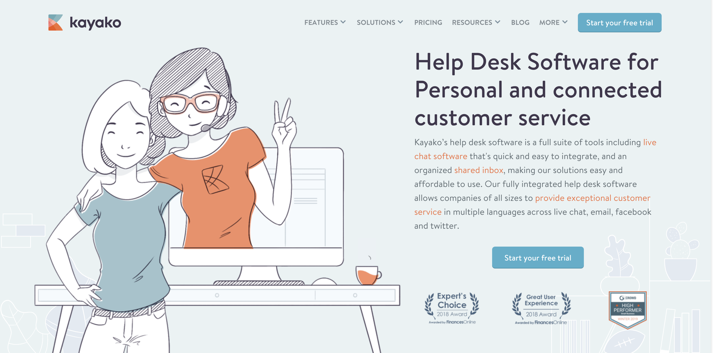
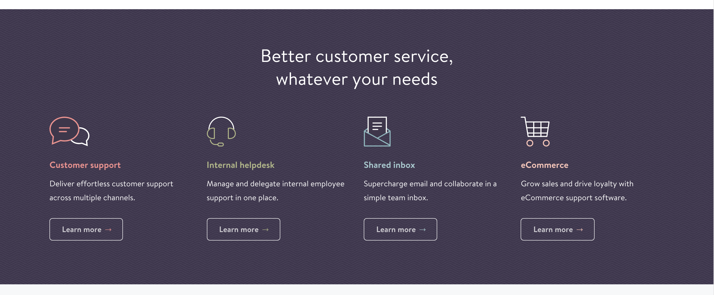
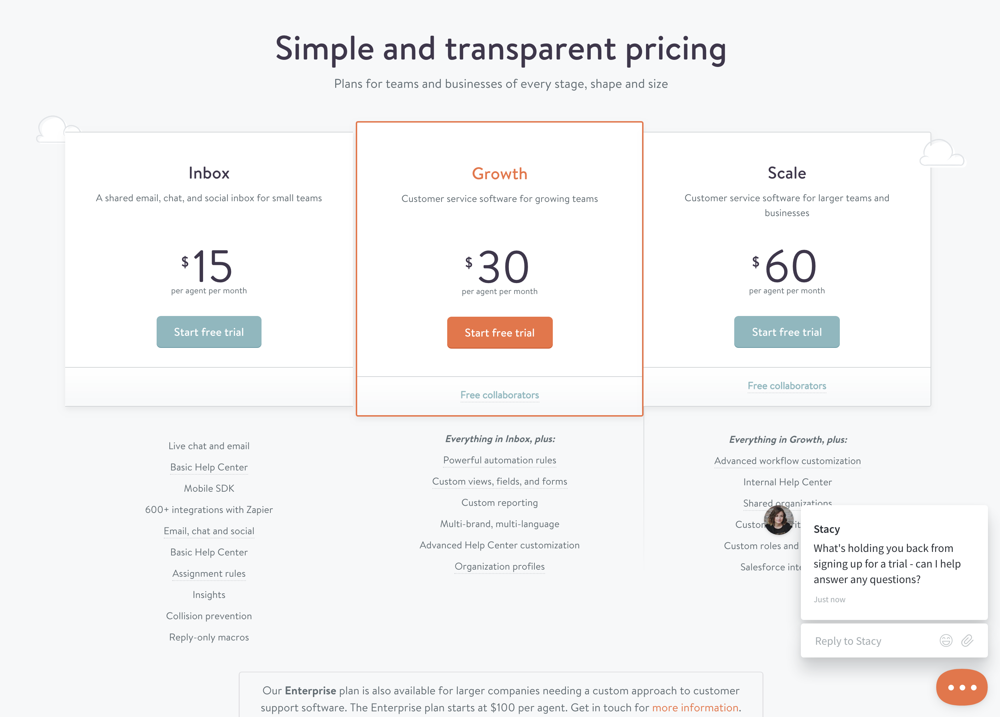
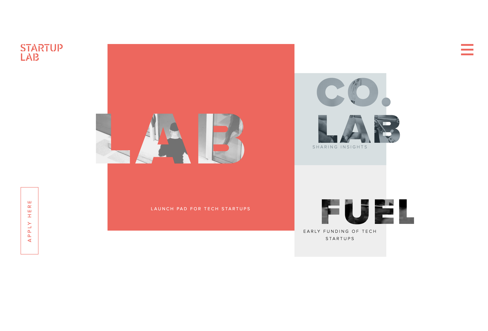
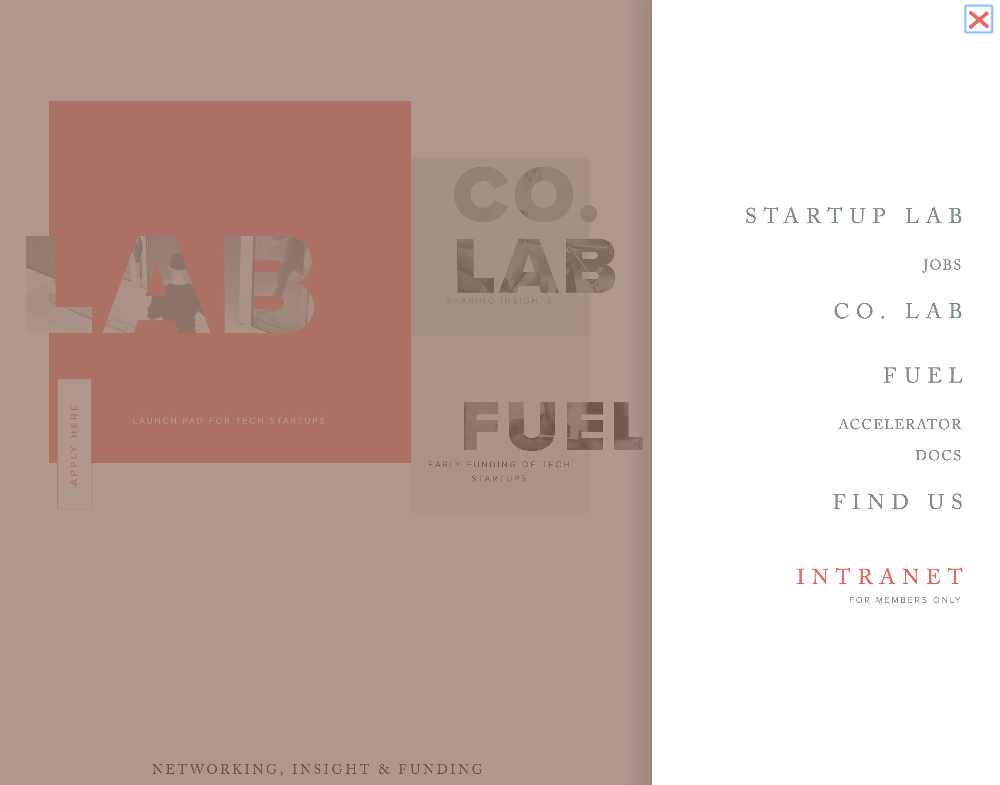
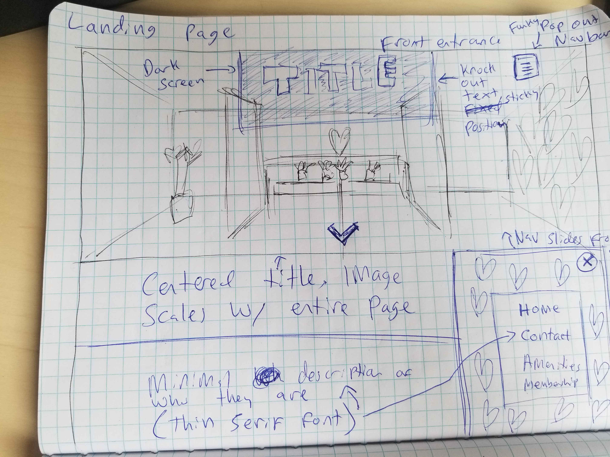
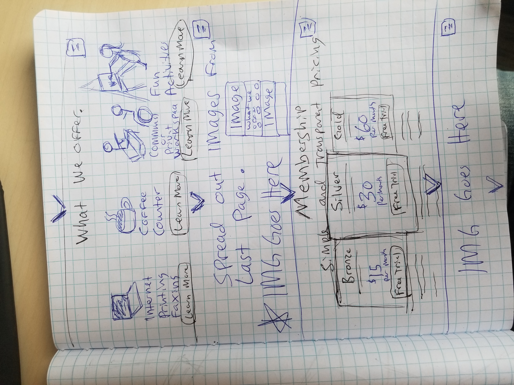
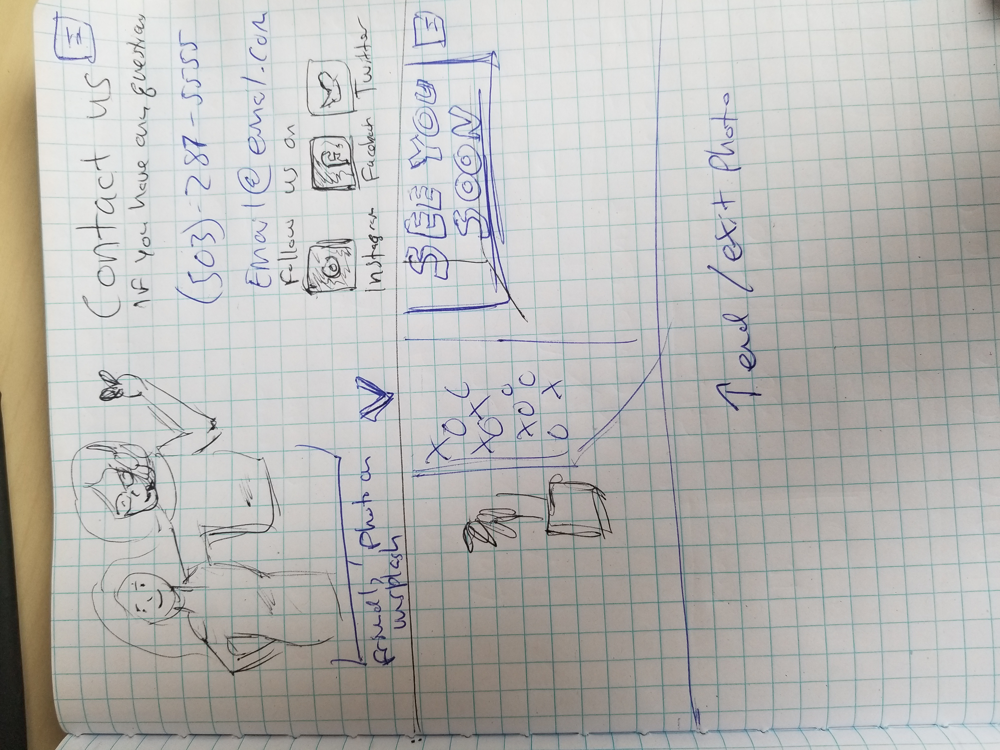
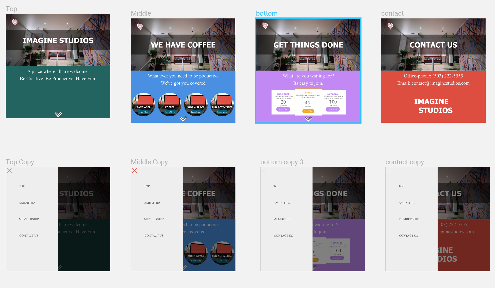

# Design-practice
## by Matt Groberg

### Description
The first part of this project was design focused, based on a non-technical prompt given a theoretical client's specifications.
First, I imagined who would be using this site, and tried to put myself in their shoes. I did a little design research, then sketched out some ideas on paper. Next I used Sketch to design a more detailed wire-frame of the website. When this was finished, I created a prototype in Sketch, to test the flow of the website.

The second part of this project involved coding a responsive version of my design. I used webpack, and a NodeJS/NPM based development environment, in order to reduce the package size of the website. I used a responsive, mobile-first design and resized my hi-res images, to further reduce load times and ensure my site still looked good on various devices. I used relative units, a flexible grid-based layout, and several media queries.

Since I was focused on CSS and design, I did not include any Javascript in this version of the website (besides what I needed for webpack and NodeJS to function). In future versions of this site, the heart-toggle should open a side nav-bar, like the one in my sketch file. In addition, the scroll-prompt should be active, to give the option of clicking it to scroll to the next section.

## Technologies Used
* Sketch
* Git
* HTML
* CSS with Sass
* Web-pack
* NodeJS and NPM

## Setup Instructions
1.  Make sure your computer has NodeJs and NPM installed.
2.  Clone or download this repo.
3.  My main sketch file is in a folder called "sketch-files", which you can open in Sketch to view the wire-frame and prototyping.
4.  To view the website, cd into the cloned repo and run this command to install dependencies: npm Install
5.  When these are finished installing, use this command to start the dev server and open the site: npm run start

## Client design specs

In general these are some design elements that the client wants:

* Their online presence to mirror their workspace (see img/work-space folder).

* Want their company "to feel a little luxurious, cool, and high-end; yet still 100% welcoming and inclusive to everyone."

* Convey their image as funky and local (less corporate, more fun).

* Not too _techy_, community of artists and traditional business people.

* Show off their amenities:
  * coffee-counter
  * communal and private work-spaces
  * high-speed internet, printing, faxing
  * fun optional activity on Thursdays (like yoga).

* _At least_ the following pages:
  * Landing
  * Contact
  * Amenities
  * Subscription model/cost/membership/how to join
## User Stories

1. The Artist:
  _I need a place to create, without the drudgery of modern city life_

Needs:
* To know what sort of creative opportunities are offered
* To see creativity in the site
* A seemless navigation system (not a wall of text and a bunch of links)

Pain Points:
* Too much of a corporate feel
* Not enough color on the pages

How can we serve
* Use a lot of color on the site
* Show creative opportunities
* Keep navigation simple, and intuitive

1. The Techy:
  _I need to decompress, but I also have a lot of work to get done_

Needs:
* To know what sort of wifi is offered
* The website to seem modern
* To see that this will be a calming place

Pain Points:
* Old-fashioned website
* No indication of fast wifi and/or coffee
* Not obvious that work can be done here.

How can we serve
* Use a modern design, maybe a single page site
* make sure to show there is wifi and coffee
* show there are a variaty of work areas, but also plenty of decompression opportunities

## Design Research

First I looked at the TechSpace website, to see what _not_ to do, since they mentioned it specifically as the corporate personality they were trying to _avoid_. I noticed a lot of people on computers, and a certain air of professional-first culture. Definitely not the _funky, fun, inclusive_ website the client wants!

I did a rapid google search for "small start-up companies with cool websites", and checked out a few.

I liked the welcoming and "non-corporate" feel of kayako.com

They they had a nice look to their services:

And also the way they layout of their pricing:

Next I searched looked through the Awwwards site for "fun" and "startup" websites. I liked the image behind the text on the site startuplab.no site,

as well as the pop-out navbar on the side of the screen.

The contrasting typefaces between the navbar and the main titles were elegant, cool --maybe even _a little bit "funky"?_

## Sketches

Here are a few sketches that I did to incorporate these elements into a design. In general, notes or accented items are in blue, and the actual images are in black.

## Wire-framing

Here is my basic wireframe completed in Sketch:

## MIT license C Matt Groberg 2019
