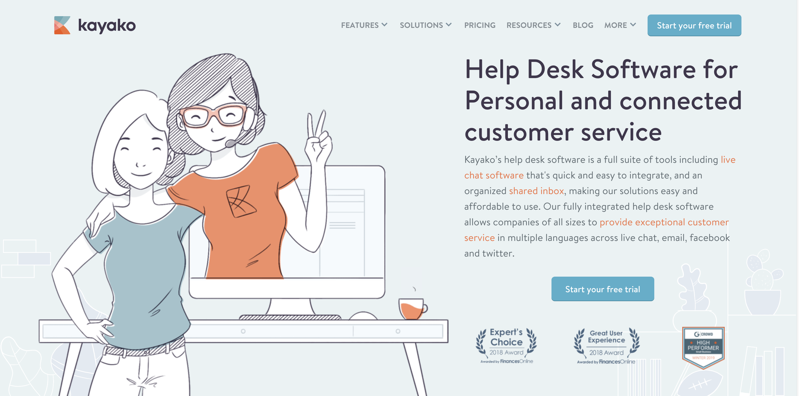
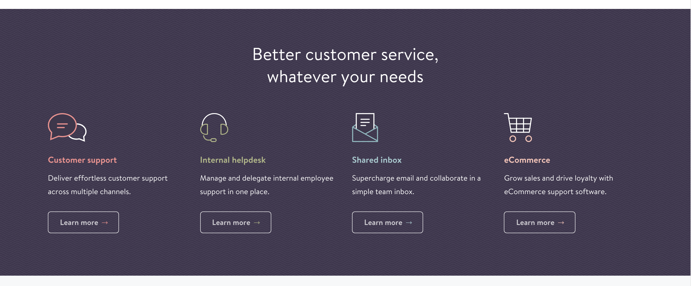
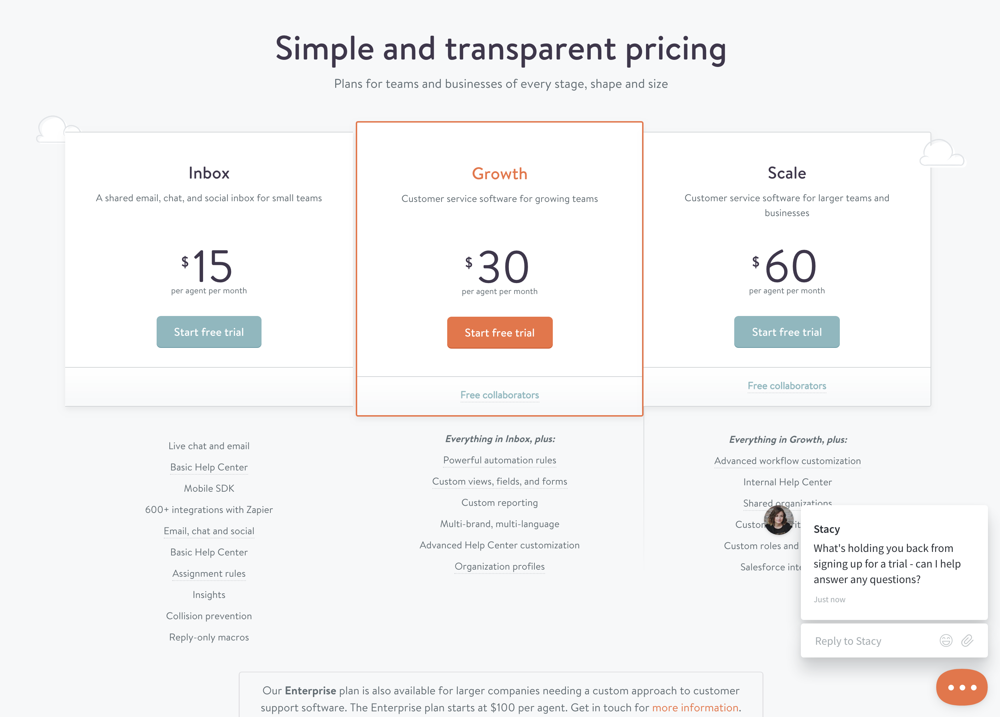
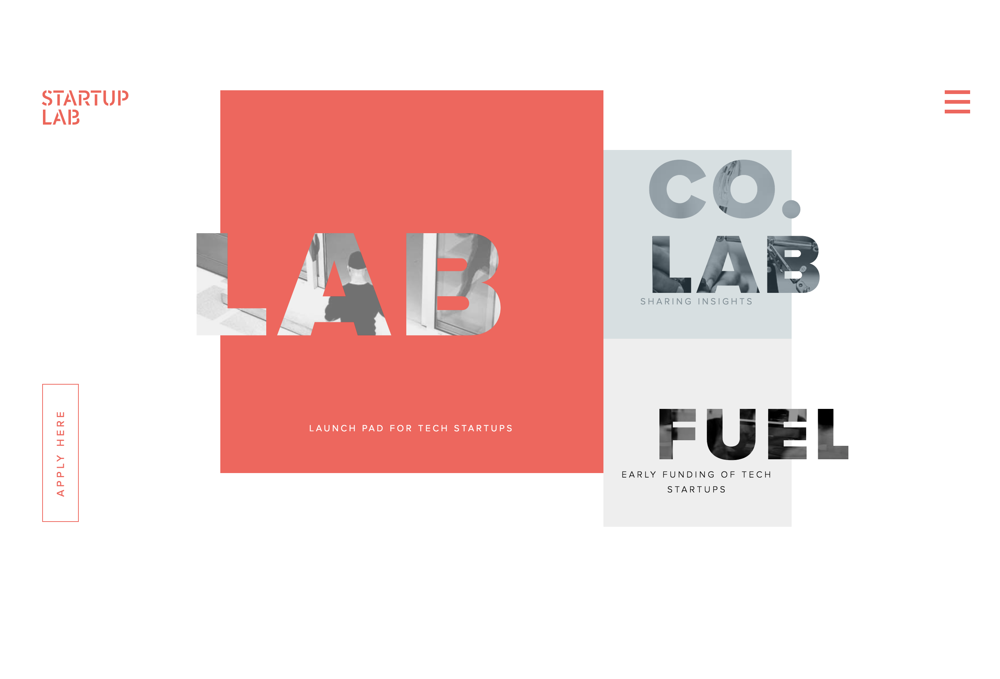
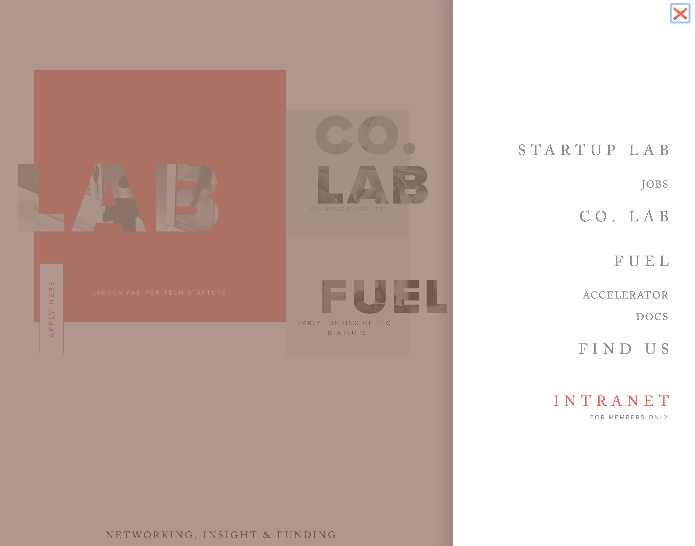

# Design-practice
## by Matt Groberg

_Part one of an independent design project, given a clients specifications_

### Description

## Client design specs

In general these are some design elements that the client wants:

* Their online presence to mirror their workspace (see images folder).

* Want their company "to feel a little luxurious, cool, and high-end; yet still 100% welcoming and inclusive to everyone."

* Convey their image as funky and local (less corporate, more fun).

* Not too _techy_, community of artists and traditional business people.

* Show off their amenities:
  * coffee-counter
  * communal and private work-spaces
  * high-speed internet, printing, faxing
  * fun optional activity on Thursdays (like yoga).

* _At least_ the following pages:
  * Landing
  * Contact
  * Amenities
  * Subscription model/cost/membership/how to join

## Design Research

First I looked at the TechSpace website, to see what _not_ to do, since they mentioned it specifically as the corporate personality they were trying to _avoid_. I noticed a lot of people on computers, and a certain air of professional-first culture. Definitely not the _funky, fun, inclusive_ website the client wants!

I did a rapid google search for "small start-up companies with cool websites", and checked out a few.

I liked the welcoming and "non-corporate" feel of kayako.com

They they had a nice look to their services:

And also the way they layout of their pricing:

Next I searched looked through the Awwwards site for "fun" and "startup" websites. I liked the image behind the text on the site startuplab.no site,

as well as the pop-out navbar on the side of the screen.

Elegant, cool --maybe even _a little "funky"?_

### Sketches
